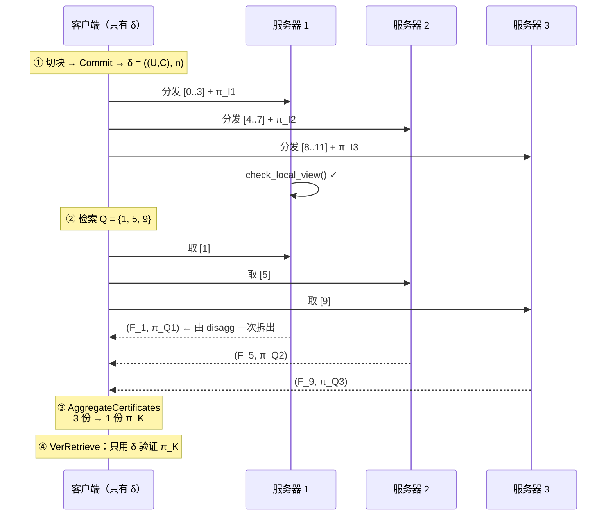

# 项目介绍：可验证分布式存储（python_SVC_v1）

> 一句话概括：**一个文件被切成块分散在互不信任的服务器上；任何人取回其中若干块时，
> 服务器返回内容 + 一个只有两个群元素的证据；多份证据能聚合成一份；
> 客户端只凭手里一个常数量摘要，验证一份证据就能确认所有内容的完整性。**

实现依据：ASIACRYPT 2020,
*Incrementally Aggregatable Vector Commitments and Applications to Verifiable Decentralized Storage*
（eprint 2020/149）的 **§5.2（第二个 SVC 构造）** 与 **§8.2（第二个 VDS 构造）**。

---

## 目录

1. [要解决的问题](#1-要解决的问题)
2. [为什么难：三个矛盾](#2-为什么难三个矛盾)
3. [方案骨架](#3-方案骨架)
4. [核心抽象：证明就是摘要](#4-核心抽象证明就是摘要)
5. [完整算法](#5-完整算法)
6. [VDS 应用层](#6-vds-应用层)
7. [文件增删改](#7-文件增删改)
8. [安全直觉](#8-安全直觉)
9. [性能与复杂度](#9-性能与复杂度)
10. [代码结构与 API](#10-代码结构与-api)
11. [测试策略](#11-测试策略)
12. [快速上手](#12-快速上手)
13. [与论文的对照及未实现部分](#13-与论文的对照及未实现部分)

---

## 1. 要解决的问题

把一份文件拆成**n**块，交给**k**台**互不信任**的服务器分别保管。之后：

- 任何人（不只是文件主人）都可以向这些服务器索取任意一段内容；
- 服务器返回内容的同时必须交出**证据**；
- 客户端从多台服务器拿到的多份证据，要能**合并成一份**；
- 客户端用它仅有的**一个摘要**验证这一份证据，从而确认**所有**取回内容都没被动过。

三个硬指标：

| 指标 | 含义 | 本方案的达成方式 |
|---|---|---|
| **摘要常量** | 客户端保存的东西不能随文件变大 | `δ = ((U,C), n)`，两个群元素 + 一个整数 |
| **证据常量** | 一份证据的大小不能随「取多少块」变化 | `π_I = (S_I,Λ_I)`，永远两个群元素 |
| **验证常量** | 验证代价不能随**文件长度**增长 | 与 `n` 无关，只与被打开的块数 `|I|` 线性 |

---

## 2. 为什么难：三个矛盾

朴素做法在每一步都会撞墙：

**① 想要常数参数，就不能把见证塞进公开参数。**
Catalano–Fiore 原方案里 `S_i = g^{e_{[n]}/e_i}` 是位置 `i` 的成员见证，
验证时要拿它去算 `Λ_i^{e_i}·S_i^{v_i} = C`，所以 `(S_1,…,S_n)` 必须放进公开参数 ——
参数就变成了 `O(n)`。

**② 想要常数证据，就不能给每个位置单独发证明。**
逐位置证明的总大小是 `O(|I|)`。

**③ 想要能验证，就绕不开「求根」。**
证据天然是「某个群元素的 `|I|` 次根」。而群是**隐藏阶**的
（模数 `N=pq` 的分解在生成后被丢弃），求根正是 RSA 假设保护的困难问题。

**本方案对 ① 的解法**：公开参数里只放一个累加器

`U_n = g^{e_{[n]}}, e_{[n]} = ∏_{i=1}^{n} e_i`

让证明方把 `S_I = g^{e_{[n]}/e_I}` 连同打开一起交出来，
验证方用**一次模幂**

`S_I^{e_I} ≟ U_n`

就把它锁死成唯一可能的值。于是公开参数从 `O(n)` 降到 `O(1)`。

**对 ③ 的解法**：注意 `e_j·e_I|e_{[n]}` 当且仅当 `j ∉ I`。
所以只要 `j` 不在被打开的下标里，

`S_j^{1/e_I} = g^{e_{[n]}/(e_j e_I)}`

**指数是整数**，直接模幂就行 —— 我们并不需要知道群的阶。

---

## 3. 方案骨架

```
 VC.Setup(1^λ, ℓ, n)      →  crs = (G, g, PrimeGen, ℓ)
 VC.Specialize(crs, n)    →  crs_n = (crs, U_n, e_all)      U_n = g^{e_[n]}

 VC.Com(crs, v)           →  (C, aux)         C = ∏_i S_i^{v_i}      ← 单个群元素

 VC.Open(crs, I, y, aux)  →  π_I = (S_I, Λ_I)                        ← 两个群元素
         S_I = g^{e_[n]/e_I}
         Λ_I = (∏_{j∉I} S_j^{y_j})^{1/e_I}

 VC.Ver(crs, C, I, y, π_I) →  b
         ①  S_I^{e_I} = U_n
         ②  S_i = S_I^{e_{I\{i}}}          对每个 i ∈ I
         ③  C = Λ_I^{e_I} · ∏_{i∈I} S_i^{y_i}

 VC.Disagg(crs, I, v_I, π_I, K)  →  π_K          K ⊆ I，大集合拆小
 VC.Agg(crs, (I,v_I,π_I), (J,v_J,π_J))  →  π_{I∪J}    I∩J=∅，小集合合大
```

**渐进聚合**是本方案相对普通 SVC 的核心增量：合并结果 `π_K` 仍然是一份合法的子向量打开证明，
所以**可以再次参与合并** —— 合并次数不限、顺序任意。

---

## 4. 核心抽象：证明就是摘要

整个实现最本质的一句话（也是代码结构的分水岭）：

> **`π_I` 就是「去掉 `I` 之后那个向量的摘要」。**

定义向量 `v` 的摘要

```
d(v) = (S, Λ), S = g^{e_{[n]}}, Λ = ∏_{i ∈ [n]} (S^{1/e_i})^{v_i}
```

把这个定义里的 `[n]` 换成 `[n]∖ I`，得到的正是 `π_I`。于是：

| 操作 | 统一视角 | 代码 |
|---|---|---|
| **承诺** | `d(v∖∅) = (U_n, C)` | `digest_of(crs_n, vals)` |
| **打开** | `d(v∖ I) = (S_I,Λ_I)` | `digest_of(crs_n, vals, I)` |
| **拆分** | 把 `I∖ K` 逐个「加回」 | `disagg` |
| **验证** | 把 `I` 全加回去，看是否变回 `d(v)` | `verify` |
| **追加位置** | 对 `d(v)` 加回一个新位置 | `update_append` |

「加回」只有一个公式，代价 `O(ℓ)`：

```
(S,Λ) ← (S^{e_i},Λ^{e_i}·S^{v_i}) （S^{v_i} 用更新前的 S）
```

### 这个抽象直接带来了 150 倍加速

「验证 = 把 `I` 逐个加回去」意味着每步的指数只有 `ℓ+1` 位；
而论文写法「先算 `S_i = S_I^{e_{I∖{i}}}` 再乘起来」里，
每次重构的指数有 `(|I|-1)(ℓ+1)` 位，`|I|` 次就是**平方级**。

| `|I|` | 旧写法 | 新写法 | 加速 |
|---|---|---|---|
| 8 | 20.2 ms | 4.6 ms | 4.4× |
| 32 | 198.3 ms | 18.7 ms | 10.6× |
| 128 | 3018 ms | 76.2 ms | **39.6×** |
| 512 | 47502 ms | 310.6 ms | **152.9×** |

（`n=1024`、`|N|=1024`、`ℓ=32` 实测）

---

## 5. 完整算法

### 5.1 `digest_of` —— 唯一的计算内核

```python
inside = [j for j in range(n) if j not in I]
S      = pow(g, prod(e_j for j in inside), N)              # 分治：product_tree
Lambda = weighted_root_product(g, v[inside], e[inside], N) # 分治：batch_root_factor
```

第二步的展开是

`∏_{j∈inside} (g^{e_{inside}/e_j})^{v_j}`

每一项的指数都是整数（因为 `j∉ I`），所以不需要开方。

### 5.2 三处分治，否则规模一上去就不可用

| 位置 | 朴素做法 | 本实现 |
|---|---|---|
| 一次算出所有 `S_i` | `n` 次「指数 `(n-1)(ℓ+1)` 位」的模幂 | `batch_root_factor`，`O(nlog n)` |
| `e_{[n]}=∏ e_i` | 顺序连乘 `O(n^2)` | `product_tree` 平衡树，`O(nlog n)` |
| `Λ_I` 的 `1/e_I` | 每个 `j∉ I` 单独模幂 | `weighted_root_product`，一次分治 + 小指数加权 |

实测（`n=1024`、`ℓ=32`）：分治比朴素快 **69 倍**；`n` 再大差距继续拉大。

### 5.3 聚合为什么必须「除交叉项」

```
ρ_I = (Λ_I)/(∏_{j∈ J}φ_j^{v_j}), σ_J = (Λ_J)/(∏_{i∈ I}ψ_i^{v_i}), Λ_{I∪ J} = ShamirTrick(ρ_I, σ_J, e_I, e_J)
```

不做这一步直接相乘会重复计数：`Λ_I` 里属于 `J` 的那部分是 `1/e_I` 次方，
而 `Λ_{I∪ J}` 里应该是 `1/(e_I e_J)` 次方，次数不匹配。

注意这里是**群除法**而不是指数相减 —— 群元素之间可以相除，
但指数上的运算必须在整数层面完成。

---

## 6. VDS 应用层

把 SVC 套上「一个客户端 + 多个存储节点」的框架。摘要

`δ = ((U,C),n)`

把 `U` 挂进摘要（而不是留在公开参数里）是 §8.2 的关键手法：
`U` 依赖当前文件长度，文件一增删就变，所以必须随摘要一起流动。

### 端到端数据流



第 ③ 步就是论文的 `AggregateCertificates`，第 ④ 步是 `ClntNode.VerRetrieve`。
**合并之后只验一次**，而不是每份验一次 —— 这是「增量聚合」的实用价值所在。

### 节点返回的证据从哪来

节点**不重新计算** `Λ_Q`，而是用 **disaggregation** 从手里的 `π_I` 拆出来：

`π_Q ← VC.Disagg(pp,I,F_I,π_I,Q), Q ⊆ I`

所以节点除了自己那块数据之外**不需要保存任何东西**，
也不需要为每个可能的 `Q` 预先算证明。

### 「节点是否老实」用一个验证器就够了

论文 §7 的正确性证明给了一个判据：
本地视图 `(pp,δ,n,st,I,F_I)` 合法 `iff` `st_1^{a_I}=δ_1 ∧ st_2^{b_I}=δ_2`。

换成 §5.2 的记号，这**正好就是 `svc.verify` 的两步校验**。
所以 `StorageNode.check_local_view()` 直接复用了同一个验证器，没有为 VDS 层另写一套。
测试验证了它的实用价值：节点偷偷丢一块，本地视图立刻失败。

---

## 7. 文件增删改

三种更新操作都已实现（`vds/updates.py`），**每个结果都用 `svc.verify` 独立验证过**。

| op | 摘要变化 | 节点状态变化 | 代价 |
|---|---|---|---|
| **`mod`** 改值 | `C' = C·∏_{i∈ K}S_i^{∆_i}`，`U'=U` | 只对 `i∈ K∖ I` 修正 `Λ_I` | `O(|K|ℓ)` |
| **`add`** 追加 | `(U',C')` = 对 `(U,C)` 顺序 `add_back` | `S'_I=S_I^{e_K}`，`Λ'_I=Λ_I^{e_K}∏_{j∈ K}(·)^{v_j}` | `O(|K|ℓ)` |
| **`del`** 删末尾 | `δ' = π_K = d(v∖ K)` | `K⊆ I` 时**一个字都不用改**；`I∩ K=∅` 时做一次 `agg` | `O(1)` / `O(|I|ℓ)` |

几个漂亮的点：

- **`mod` 里，被改的位置若在节点自己的 `I` 里，它的 `Λ_I` 完全不变** ——
  因为 `Λ_I` 只含 `j∉ I` 的值。修正项里需要的 `S_I^{1/e_i}`
  恰好就是 `ShamirTrick(S_I,S_i,e_I,e_i)`。
- **`add` 之后，新位置的证明就是旧摘要本身**：`π_K^{new} = d_{new}(v'∖ K) = (U,C)`
  —— 因为「除 `K` 之外的其余部分」正是旧文件。所以不用算任何东西。
- **`del` 的新摘要直接就是拆出来的 `π_K`**，与论文 `δ' ← ((Γ_K,∆_K), n')` 一致。

> ⚠️ **与论文的一处出入（已记录在 `docs/与论文对照.md`）**
> 论文 §8.2 的 `PushUpdate`/`ApplyUpdate` 正文里用的是 **§5.1 阴阳方案**的原语
> （`Γ/∆`、`PartndPrimeProd`），而 §8.2 的摘要却是 §5.2 的形式。
> 也就是说更新算法正文是从 §8.1 抄过来的、没真正改成 §5.2 的记号，逐字转写做不到。
> 本实现因此**从摘要代数独立推导**三个公式，并用独立的 `svc.verify` 逐步验证。

---

## 8. 安全直觉

### 为什么验证方可以零信任

客户端手里只有 `δ=((U,C),n)`。它要确认「服务器给的内容确实是当初承诺的那一份」。

1. **`S_I` 锁死**：`S_I^{e_I}=U`。不知道群阶就求不出别的 `e_I` 次根，
   所以 `S_I` 只能是 `g^{e_{[n]}/e_I}`。
2. **值锁死**：`C = Λ_I^{e_I}·∏_{i∈ I}S_i^{y_i}`。
   想换一个 `y_i` 就得同时改 `Λ_I`，而 `Λ_I^{e_I}` 的变化会被 `S_i^{y_i}` 的变化抵消 ——
   除非能开出新的 `e_I` 次根。
3. **重构的 `S_i` 可信**：`S_i` 是从已被锁死的 `S_I` 现场重构的，不是服务器给的。

三条合起来把「改内容」归约到「求 `e_I` 次根」，即 RSA 假设。
正式的安全归约见论文 §5.2 的 Theorem 5.2 与 §8.2 的 Theorem 8.2。

### 攻击实测

| 攻击 | 结果 |
|---|---|
| 服务器篡改内容（证据不动） | 逐份验证 → `BAD_LAMBDA`；**聚合阶段直接被拒** |
| 服务器伪造证据（`S_I` 乱乘一个数） | 逐份验证 → `BAD_S_I`；**聚合阶段直接被拒** |
| 服务器偷偷丢数据 | `check_local_view()` 立刻失败 |

第二列值得单独说：**聚合算法自带净能力**。`VC.Agg` 在合并 `Λ` 之前会用
`ShamirTrick` 做**同源自检**（`root_x^{x} = root_y^{y}`），
而两份来自不同数据版本的证据**根本不同源**，于是连一个可验证的假证明都拼不出来。

---

## 9. 性能与复杂度

模幂是唯一的瓶颈。CPython 的 `pow(a,b,n)` 是 C 实现（Karatsuba），
在 2048 位模数上约 **20 μs / 指数比特**。

| 操作 | 复杂度 | 说明 |
|---|---|---|
| `Setup` | 一次 RSA 模数生成 | 2048 位约 3–5 s |
| `Specialize` | **一次**指数有 `n(ℓ+1)` 位的模幂 | `n=2^{16},ℓ{+}1{=}129` → 指数 840 万位 → 数十秒 |
| `Commit` | 一次分治 + `n` 次小指数模幂 | |
| `Open` | 一次分治 | |
| **`Verify`** | **`O(ℓ|I|)`，与 `n` 无关** | 实测 ~550 μs/元素，严格线性 |
| `Agg` | 2 次 Shamir + 2 次分治 | 与**被合并的块数**成正比，与 `n` 无关 |
| `Disagg` | `O(ℓ|I∖ K|)` | |
| `DisaggAll(n,B)` | `O(nlog(n/B))`，递归二分 | `n=1024,B=8` → 128 块约 4.5 s |

**实测「验证与 `n` 无关」**（`n` 增长 16 倍，`|I|` 固定为 8）：

```
n =    64   verify 15.1 ms
n =   256   verify 21.9 ms
n = 1,024   verify 16.6 ms      比值 1.10×
```

**实测「摘要与证据是常量的」**：`n` 从 64 到 1024，
`|C|` 稳定在 1021–1024 位、`|S_I|` 稳定在 1022–1024 位（都约等于 `|N|`）。

---

## 10. 代码结构与 API

```
python_SVC_v1/
├─ svc/                     ★ 第二个 SVC（论文 §5.2）
│  ├─ mathbase.py           数学底座（清单 #1~#8）
│  ├─ groups.py             隐藏阶群生成（#9）
│  ├─ primegen.py           下标→素数映射（#10、#11）
│  ├─ scheme.py             核心抽象 + 中间量 + 本体 + 聚合拆分（#12~#26）
│  ├─ rng.py                可复现随机源
│  └─ types.py              CRS / CRSn / VectorDigest / Opening / VerifyReport
├─ vds/                     ★ 可验证分布式存储
│  ├─ digest.py             摘要 δ 与本地视图（§8.2）
│  ├─ encoding.py           文件 ↔ 块
│  ├─ storage_node.py       StrgNode.*（AddStorage / RmvStorage / Retrieve）
│  ├─ client_node.py        ClntNode.*（AggregateCertificates / VerRetrieve）
│  ├─ updates.py            文件增删改（PushUpdate / ApplyUpdate）
│  ├─ pos.py                附录 D.1 存储证明（PoR / PDP）
│  ├─ vds.py                VDSSession，串起 §8.2 的全流程
│  └─ vds1.py               ★ §8.1 的 VDS1（含 CreateFrom / GetCreate）
├─ server/app.py            零依赖演示后端（标准库 http.server）
├─ web/                     前端页面（原生 HTML/CSS/JS，无构建步骤）
├─ tests/                   509 个测试
├─ demo/end_to_end.py       §8.2 命令行端到端演示
├─ demo/vds1_create_from.py §8.1 命令行端到端演示
├─ bench/bench_scale.py     规模与性能测试
└─ docs/                    设计说明与论文对照
```

### 核心 API 速查

```python
from svc import setup, specialize, digest_of, commit, open_subvector, verify, agg, disagg

crs    = setup(lambda_bits=128, l=128, n=1024)      # VC.Setup
crs_n  = specialize(crs, 1024)                      # VC.Specialize → U_n, e_all

com    = commit(crs_n, vals)                        # VC.Com → (C, aux)
pi     = open_subvector(crs_n, I, vals_I, vals)     # VC.Open → (S_I, Λ_I)
report = verify(crs_n, com.C, I, vals_I, pi)        # VC.Ver → VerifyReport
report.code  # VerifyCode.OK / BAD_SHAPE / BAD_S_I / BAD_LAMBDA

pi_K   = agg(crs_n, I, v_I, pi_I, J, v_J, pi_J)     # VC.Agg
pi_K2  = disagg(crs_n, I, v_I, pi_I, K)             # VC.Disagg

d      = digest_of(crs_n, vals, excluded=I)         # 统一抽象：d(v \ I)
```

```python
from vds import VDSSession
from vds.updates import update_modify, update_append, update_truncate

s      = VDSSession(n_max=1024, l=128)
delta, crs_n, vals, nbytes = s.commit_bytes(data, block_bytes=16)

nodes  = s.distribute(delta, vals, [[0,1,2], [3,4,5], ...])
client = s.make_client(delta)

F_Q, certs, used = s.retrieve_from(nodes, Q)
pi_K = client.aggregate_certificates(certs)         # AggregateCertificates
report = client.ver_retrieve(Q, F_Q, pi_K)          # ClntNode.VerRetrieve
assert report.ok

# 更新
rec = update_modify(s, delta, nodes, K, F_new)      # op = mod
rec = update_append(s, delta, nodes, F_new)         # op = add
rec = update_truncate(s, delta, nodes, K)           # op = del
delta, nodes = rec.new_delta, rec.new_nodes
```

---

## 11. 测试策略

**509 个测试全部通过。** 设计原则是「不与自己对拍」：

| 文件 | 覆盖 | 关键手法 |
|---|---|---|
| `test_mathbase.py` | 清单 #1~#8 | 每个函数都用**独立暴力实现**对照 |
| `test_primegen.py` | #9~#11 | 重点是**互异性**与位长约束（静默出错最致命） |
| `test_scheme.py` | #12~#22 | 批处理路径 vs 朴素路径**逐位相同** |
| `test_agg_disagg.py` | #23~#26 | **真聚合 == 对新集合从零算一遍** |
| `test_core_abstraction.py` | 统一摘要层 | `digest_of(vals,∅)==(U_n,C)`、`disagg(π_I,K)==digest_of(vals,K)`、加回顺序无关 |
| `test_fastopen.py` | §4.2 | 块划分最小覆盖、`FastOpen` 与直接 `Open` 等价 |
| `test_vds.py` | §8.2 全流程 | 篡改 / 伪造 / 丢数据三类攻击 |
| `test_updates.py` | 增删改 | 每次更新后**所有节点视图合法 + 检索验证通过 + 内容按预期变化** |
| `test_pos.py` | 附录 D.1 | 挑战覆盖/未覆盖、聚合后一次验证全量 |
| `test_yinyan.py` | §5.1 | `a_j · b_j = u_I` 不变量、拆合、`k = 2` |
| `test_pok.py` | §6 | 四个 AoK：换语句/换分量/换转录都要被拒 |
| `test_vds1.py` | §8.1 | `CreateFrom`/`GetCreate`、`I ∩ K` 三种情形、重放与陈旧摘要 |

两条最重要的原则：

**① 聚合不能只验「能不能通过」。**
一个把 `Λ` 算错但在别处凑巧抵消的实现，也能让「聚合后验证通过」成立。
所以关键用例一律是 `assert 真聚合的结果 == 直算的结果`。

**② 更新不能只验「摘要变了」。**
`test_updates.py` 每个用例都同时检查三件事：所有节点视图合法、客户端能检索任意子集并通过验证、
内容确实按预期变了。三条同时成立，公式就不可能错 ——
因为 `svc.verify` 是独立实现，它不关心更新是怎么算出来的。

---

## 12. 快速上手

```bash
cd python_SVC_v1

# 命令行端到端演示
python demo/end_to_end.py        # §8.2 的 VDS2
python demo/vds1_create_from.py  # §8.1 的 VDS1（派生新文件 + 三种更新）

# 测试
python -m pytest

# 性能与常量性
python bench/bench_scale.py --modulus 1024 --l 32 --sizes 64,256,1024 --open-size 8

# Web 演示
python server/app.py          # → http://127.0.0.1:8000
```

Web 页面可以：设定参数 → 输入内容 → 一键跑完整流程 → 看到摘要、每台服务器状态、
检索到的多份证据、聚合后的唯一证据、验证结果；还能点「让服务器篡改内容 / 伪造证据」
看攻击在哪一步被抓住。

页面底部还有第五节的 **§8.1 `VDS1` 演示**：它现场另建一份独立会话，
跑完整条流水线，重点展示 §8.2 没有的 **`CreateFrom` / `GetCreate`**
（派生新文件 + 客户端常数大小验证），
以及 `mod` / `add` / `del` 三种更新在 `I ∩ K` 各种情形下的本地状态维护，
最后跑四类攻击。详见 `demo/vds1_create_from.py`。

所有群元素（U、C、S<sub>I</sub>、Λ<sub>I</sub>）默认只显示 4 字节指纹，
**点一下就能展开完整的十六进制值**（512 位的模数 = 130 个字符）；
也可以点「⤢ 展开全部完整值」一次看全部，或点旁边的 `⧉` 复制。

> 演示建议把**模数位长设成 512**，速度差两个数量级。
> 512 位只够跑通代数关系，**没有任何安全强度**；真实部署需要 2048 位以上。

---

## 13. 与论文的对照及实现范围

完整逐条对照见 [`docs/与论文对照.md`](./与论文对照.md)。

### ✅ 已实现（三条主线全部完成）

| 主线 | 论文 | 代码 |
|---|---|---|
| 第二个 SVC（单个群元素的承诺） | §5.2、§4.2 | `svc/scheme.py`、`svc/fastopen.py` |
| `VDS2`（基于 §5.2） | §7、§8.2 | `vds/` |
| 存储证明 PoR / PDP | 附录 D.1 | `vds/pos.py` |
| 第一个 SVC（阴阳方案，双累加器） | §5.1 | `svc/yinyan.py` |
| 知识论证族（含 §6.3） | §6 | `svc/pok.py` |
| `VDS1`（含 `CreateFrom` / `GetCreate`） | §8.1 | `vds/vds1.py` |

再加上清单 #1~#26（含可选的 `disagg_one_to_many` / `agg_many_to_one` 加速）。

### 为什么会有两套 SVC 和两套 VDS

|  | §5.2 / `VDS2` | §5.1 / `VDS1` |
|---|---|---|
| 承诺 | **1** 个群元素 | 2 个群元素（一对累加器） |
| 打开证明 | **2** 个群元素 | 2 个群元素 |
| CRS 生成元 | 一个 `g` | 三个 `g, g₀, g₁` |
| 承诺时额外开销 | —— | `k` 个 `PoProd2` |
| 派生新文件 | ✗ | ✅ `CreateFrom` / `GetCreate` |
| 需要 `VC.Specialize` | 是（`U_n` 要进摘要） | 否 |

§5.2 更省，§5.1 多出来的那对累加器换来了 `PoKSubV` ——
**只存了文件一部分的节点能从中派生出一个新文件**，而客户端只靠一个
常数大小的证明就能确认新摘要确实是原文件的那一段。两者不是替代关系。

### ❌ 仍然没做的

| 未实现 | 原因 |
|---|---|
| 附录 C 的 `PoKChange` / `PoKAdd` / `PoKDelete` | 三种更新的**零知识**论证。本实现的 §8.1 更新走「发布 `Υ_∆` + `VC.Ver'` 验证」，功能上已是完整链路；只有「更新内容本身敏感」时才必需它们 |
| 并行化 | 素数生成与大批量模幂目前单线程。加速要用 `multiprocessing` 而非线程 —— CPython 的模幂计算期间**持有 GIL** |
| 附录 A / B / D.2 / E / F | A 是 `PoProd` 的低效写法（论文自己说更慢）、B 是 [BBF19] 的预处理分析、D.2 是 `VDS1` 的 PDP（附录 D.1 的通用 PoR 已实现）、E 是强安全变体（验证时间线性于文件长度）、F 是与 BBF19 的实测对比 |
| §8.3 的「分块哈希」包装 | 把 `N·ℓ_H` 比特压到 `N·2λ` 比特的代价，从而支持 2^20 比特级文件；不影响正确性，只影响能撑多大 |

详见 [`docs/与论文对照.md`](./与论文对照.md) §5。

### 实现中发现的、值得记录的坑

1. **`shamir_trick` 的同源自检不能省**。它不只是「防错」，而是聚合算法自带的净能力：
   攻击场景下 `ρ_I` 与 `σ_J` 不同源，函数返回 `⊥`，连假证明都拼不出来。
2. **`Λ_∅ = C` 而不是 1**（空乘积 `e_∅=1`）。`I=[n]` 时 `Λ_I=1` 才对。
   我自己一开始写错了，被自己的测试纠正。
3. **素数互异性是硬前提**，不是「最好满足」。哈希版映射在位数小时必然碰撞，
   而碰撞让 `ShamirTrick` **静默算错**（不崩溃、只是结果不对）。
   所以 `PrimeGen` 默认双射、`PrimeGenHash` 默认开启碰撞检测、位长不足时抛异常。
4. **`Opening.I` 必须与视图的 `I` 保持一致**。`agg` 返回的是并集，
   而 `del` 之后节点真正持有的集合变小了 —— 忘记重包 `Opening` 会让 `verify`
   的形状检查直接拒绝，表现为「更新完节点就失效」。
5. **`mod` 之后必须更新节点的 `FI`**。值改了但节点还拿着旧值去验证新证据，
   本地视图必然不过。
6. **`mod` 部分相交时抬的指数是 `a'_{L̄}` 而不是 `a'_K`**。
   `I ∩ K = L ∉ {K, ∅}` 时只有 `K` 落在 `I` 之外的那半个 `L̄` 会改变 `Γ_I`，
   抬整个 `a'_K` 会把 `I` 内部那份重复计入 —— 算出的状态通不过自检。
   这是 `tests/test_vds1.py` 抳出来的。
7. **论文 §8.1 有两处笔误**。`CreateFrom` 返回的 `st'` 应是**新摘要**下的打开，
   论文正文写的却是旧摘要下的（那样 `Ver'(δ', J, F_J, st')` 根本不成立）；
   `add` 发布者的 `st' ← st` 理由（`π_I = π'_J`）不成立但结论对。
   详见 `docs/与论文对照.md` §4.5。

---

## 附：一句话记忆点

- **证明就是摘要**：`π_I = d(v∖ I)`，承诺是 `I=∅` 的特例。
- **加回**：`(S,Λ) ← (S^{e_i},Λ^{e_i}S^{v_i})` ——
  拆分、验证、追加三件事都只是把它循环几次。
- **`U_n` 是那个「常数参数的秘密」**：公开参数里只放它，
  `S_I^{e_I}=U_n` 一次模幂就把见证锁死了。
- **`1/e_I` 能公开算，是因为 `j∉ I` 时 `e_j·e_I|e_{[n]}`** ——
  指数是整数，不用求根。
